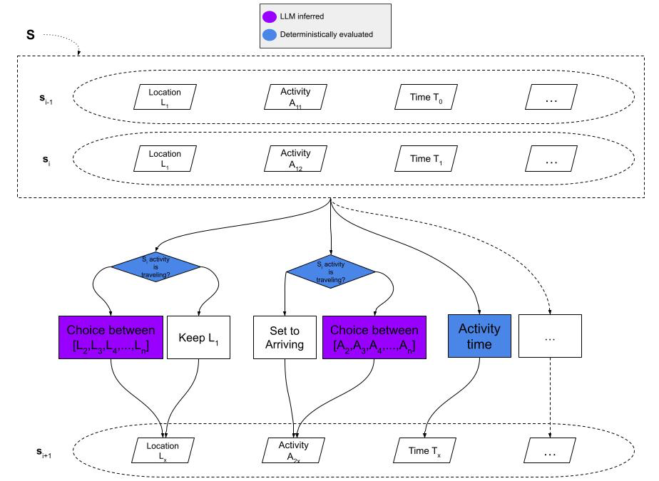
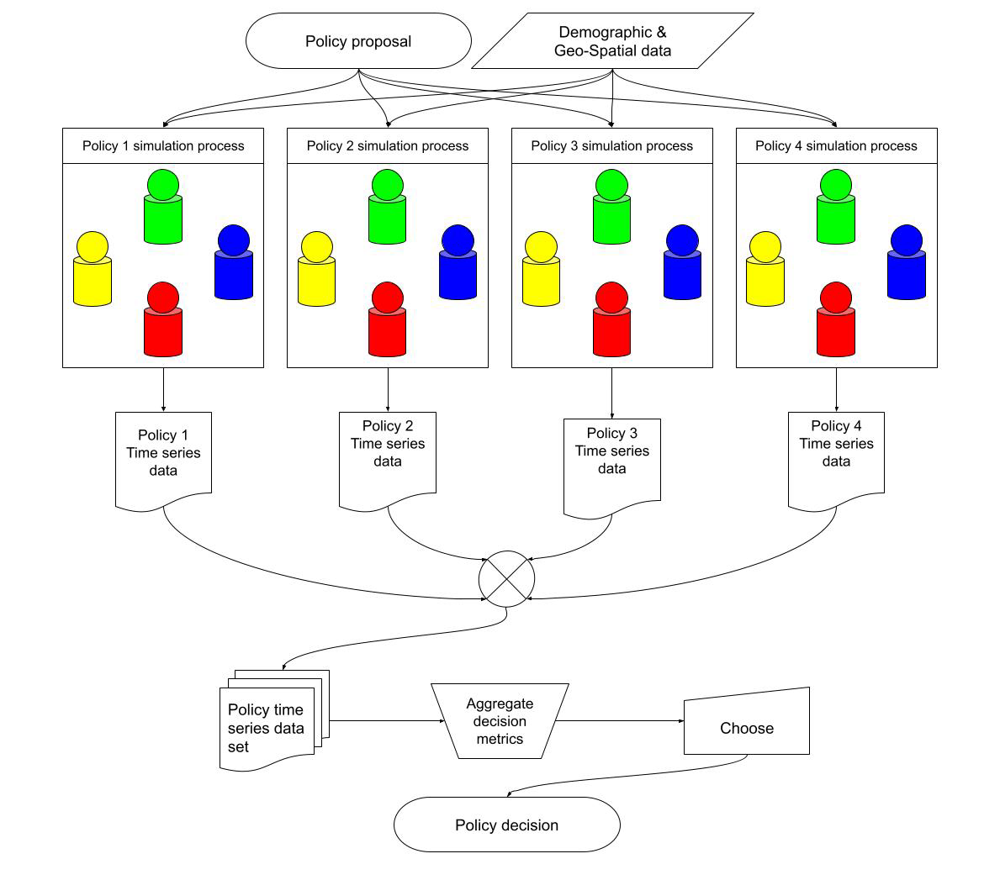

# tamaki-municipality-agent-based-simulation

## Table of contents
- [Simulation overview](#simulation-overview)
- [Figures](#figures)
- [Code overview](#code-overview)
- [Data sources](#data-sources)
  - [2021 Survey on Time Use and Leisure Activities](#2021-survey-on-time-use-and-leisure-activities)
    - [Questionnaire A](#questionnaire-a)
    - [Table Number 70-1-1](#table-number-70-1-1)
    - [Table Number 70-1-2](#table-number-70-1-2)
    - [Table Number 13](#table-number-13)
    - [Appendix Table A](#appendix-table-a)
  - [2020 Population Census](#2020-population-census)
    - [Table Number 2-5-1](#table-number-2-5-1)
  - [2022 National Survey on Living Conditions](#2022-national-survey-on-living-conditions)
    - [Table Number 30](#table-number-30)
  - [Tamaki Town Municipality Boundaries](#tamaki-town-municipality-boundaries)
    - [Boundary Shapefile](#boundary-shapefile)
- [Statistical Comparison of Mean Time Spent on Activities in Simulation and Survey data](#statistical-comparison-of-mean-time-spent-on-activities-in-simulation-and-survey-data)

## Simulation overview
The defined state attributes that were used were:
- **Reasoning**: A plain text attribute for the agent to perform Chain-of-Thought reasoning about its state before filling in the following attributes. Included as a compromise between using reasoning functionality and constrained sampling which are two features that are mutually exclusive in the LLM provider used in this study.
- **Memory**: A plain text attribute for the agent to write down things it deems important to remember for the next state. Included as a compromise between including a long state history (to counteract issues such as "lost in the middle" shown by Liu et al.) and keeping the simulation history-less.
- **Activity**: Different activities that the agent is allowed to choose from during the simulation. What activities are available to choose is based on the type of location the agent was in during the last state.
- **Location**: Different locations that the agent can visit during the simulation. The only way for the agent to change its location in the next state is by selecting a traveling activity in the current state.
- **Time**: A completely deterministic value that is updated each step by a time mapped to an activity in a fixed table.

There was also a set of accompanying prompt arguments included. These served as contextual information for the LLM's decision process, for example distance to other locations.

## Figures

*Red dot icons are locations registered by Google Maps, Blue house icons are randomly picked houses used as agent starting points, the red border is the municipality boundary, the inner multicolored shapes are municipality subdivisions.*

*The flowchart figure visualizes how a sequence of visited states $S$ transitions into a new state $s_{i+1}$ utilizing both inferred LLM choices and deterministic functions.*

*The flowchart figure visualizes how the different scenarios are simulated, the data extracted, aggregated and presented as PIT for decision support. In the simulation code this process is done once for each LLM model.*

## Code overview
A data -> simulation -> results pipeline using the LSPS package. Setup of the pipeline is loosely based on a microservices architecture. Each script is highly modular and can be run independently.

## Data sources
Below is a full list of sources for all the data used in this simulation.

> **!NOTICE!**: Set API URL appId parameter manually (appId=your-app-id) to access, this requires you to sign up on the e-stat website, published by the Japanese government

### 2021 Survey on Time Use and Leisure Activities 

#### Questionnaire A 
**Statistics name**: 2021 Survey on Time Use and Leisure Activities, **Document title**: Questionnaire A, **Document URL**: [URL](https://www.stat.go.jp/english/data/shakai/2021/pdf/qua.pdf), **Accessed**: Jul 15, 2026

#### Table Number 70-1-1 
**Statistics name**: Survey on Time Use and Leisure Activities 2021 Survey on Time Use and Leisure Activities Questionnaire A Results on Time Use Time Use for Prefectures, **Table title**: Average time spent in activities for all persons by Kind of activities, Day of the week, Area classification, Sex, Usual economic activity, Usual state of health, Age (15 Years Old and Over)-Japan, Prefectures, **Table URL**: [URL](https://www.e-stat.go.jp/en/dbview?sid=0003457372), **Table API**: [URL](https://api.e-stat.go.jp/rest/3.0/app/getStatsData?cdCat05=0%2C6%2C7&cdArea=24000&appId=&lang=E&statsDataId=0003457372&metaGetFlg=Y&cntGetFlg=N&explanationGetFlg=Y&annotationGetFlg=Y&sectionHeaderFlg=1&replaceSpChars=0), **Accessed**: Oct 06, 2026

#### Table Number 70-1-2 
**Statistics name**: Survey on Time Use and Leisure Activities 2021 Survey on Time Use and Leisure Activities Questionnaire A Results on Time Use, Time Use for Prefectures, **Table title**: Average time spent in activities for all persons by Kind of activities, Day of the week, Area classification, Sex, Usual economic activity, Usual state of health, Age (15 Years Old and Over)-Japan, Prefectures, **Table URL**: [URL](https://www.e-stat.go.jp/en/dbview?sid=0003457373), **Table API**: [URL](http://api.e-stat.go.jp/rest/3.0/app/getSimpleStatsData?cdCat01=1&cdCat03=0%2C1%2C2&cdCat05=0%2C6%2C7&cdArea=24000&appId=&lang=E&statsDataId=0003457373&metaGetFlg=Y&cntGetFlg=N&explanationGetFlg=Y&annotationGetFlg=Y&sectionHeaderFlg=1&replaceSpChars=0), **Accessed**: Jul 16, 2026

#### Table Number 13 
**Statistics name**: Survey on Time Use and Leisure Activities 2021 Survey on Time Use and Leisure Activities Questionnaire A Results on Time Use, Time Use for Prefectures, **Table title**: Standard Error Ratios of Average time spent in activities for all persons by Sex, Kind of activities - Weekly average, Japan, Prefectures, **Table URL**: [URL](https://www.stat.go.jp/english/data/shakai/2021/zuhyou/2021gosaA013.xlsx), **Accessed**: Jul 15, 2026

#### Appendix Table A 
**Statistics name**: Survey on Time Use and Leisure Activities 2021 Survey on Time Use and Leisure Activities Questionnaire A Results on Time Use, Time Use for Prefectures, **Table title**: Number of Sample EDs, Households and Persons by Prefectures (Questionnaire A), **Table URL**: [URL](https://www.stat.go.jp/data/shakai/2021/zuhyou/huhyoua.xlsx), **Accessed**: Jul 15, 2026

### 2020 Population Census 

#### Table Number 2-5-1 
**Statistics name**: Population Census 2020 Population Census Basic Complete Tabulation on Population and Households, **Table title**: Population by Sex, Age (single years) and All nationality or Japanese - Japan, Prefectures, Municipalities (including Municipalities as of 2000), **Table URL**: [URL](https://www.e-stat.go.jp/en/dbview?sid=0003445139), **Table API**: [URL](https://api.e-stat.go.jp/rest/3.0/app/getStatsData?cdCat01=1&cdArea=24461&cdCat03=066%2C067%2C068%2C069%2C070%2C071%2C072%2C073%2C074%2C075%2C076%2C077%2C078%2C079%2C080%2C081%2C082%2C083%2C084%2C085%2C086%2C087%2C088%2C089%2C090%2C091%2C092%2C093%2C094%2C095%2C096%2C097%2C098%2C099%2C100%2C101&appId=&lang=E&statsDataId=0003445139&metaGetFlg=Y&cntGetFlg=N&explanationGetFlg=Y&annotationGetFlg=Y&sectionHeaderFlg=1&replaceSpChars=0), **Accessed**: Jul 16, 2026

### 2022 National Survey on Living Conditions 

#### Table Number 30 
**Statistics name**: National Survey on Living Conditions, 2022 National Survey on Living Conditions: Health, **Table title**: Household size (15 years and older), health awareness, gender, age (5-year age groups), and education level, **Table URL**: [URL](https://www.e-stat.go.jp/dbview?sid=0002040972), **Table API**: [URL](https://api.e-stat.go.jp/rest/3.0/app/getStatsData?cdTab=2580&cdTime=15&cdCat02=370%2C400%2C410%2C440%2C450&cdCat04=110&cdCat01=110%2C120%2C130%2C140%2C150%2C160&appId=&lang=J&statsDataId=0002040972&metaGetFlg=Y&cntGetFlg=N&explanationGetFlg=Y&annotationGetFlg=Y&sectionHeaderFlg=1&replaceSpChars=0), **Accessed**: Jul 16, 2026

### Tamaki Town Municipality Boundaries 

#### Boundary Shapefile 
**Statistics name**: 2020 Population Census Boundary Data (e-Stat GIS), **Boundary title**: 24461 tama-ki-chō (Tamaki Town), **Download URL**: [URL](https://www.e-stat.go.jp/gis/statmap-search/data?dlserveyId=A002005212020&code=24461&coordSys=1&format=shape&downloadType=5&datum=2000), **Page URL**: [URL](https://www.e-stat.go.jp/gis/statmap-search?page=2&type=2&aggregateUnitForBoundary=A&toukeiCode=00200521&toukeiYear=2020&serveyId=A002005212020&prefCode=24&coordsys=1&format=shape&datum=2000), **Accessed**: Jul 15, 2026

## Statistical Comparison of Mean Time Spent on Activities in Simulation and Survey data
An independent two-sample comparison using **Welch's $t$-test** is conducted to evaluate differences between the simulated agents' mean weekly time spent on each activity and the mean weekly time spent on each activity by the citizens who participated in the 2021 Survey on Time Use and Leisure Activities (Questionnaire A). Because the simulation and survey cohorts have unequal sample sizes ($N_{\text{sim}} = 100$ vs. $N_{\text{val}} = 800$) and unequal variances, equal variance is not assumed:

1. **Sample Sizes ($N$)**:
   - **Simulation ($N_{\text{sim}} = 100$)**: Sample of $N = 100$ simulated autonomous elderly agents (aged 65+) under Scenario 2.
   - **Survey Subgroup ($N_{\text{val}} = 800$)**: Benchmark sample size of elderly (65+),
     non-working citizens in Mie Prefecture derived from Table 70-1-1 (*Average time spent in
     activities for all persons by Kind of activities, Day of the week, Area classification,
     Sex, Usual economic activity, Usual state of health, Age (15 Years Old and Over) - Japan,
     Prefectures*), reflecting approximately 800 respondents across all households in Mie
     Prefecture.
   - **Survey Total Sample ($N_{\text{total}} = 3{,}372$)**: Total sampled respondents in Mie Prefecture across all ages (15+) and employment statuses from Questionnaire A (`Sample_Persons_Average_Time` in `data/processed/Questionnaire A.csv`).

2. **Activity Means ($\bar{x}$) and Alignment**:
   - **Simulation Mean ($\bar{x}_{\text{sim}}$)**: Evaluated over each agent's first 24-hour cycle ($1{,}440\text{ minutes}$) starting from initial deployment ($T_0 = \text{2026-06-10 08:00:00}$ to $T_1 = \text{2026-06-11 08:00:00}$). Restricting the analysis window to exactly 24 hours (1 daytime cycle and 1 nighttime sleep cycle) ensures consistent daily proportions and avoids sleep deflation from multi-day partial spans. All transportation modes (`Walking`, `Riding bus`, `Driving car`, `Riding taxi`, `Riding mobility-on-demand shuttle`, `Riding bike`) as well as `Arriving` events are consolidated into a unified `Moving` category.
   - **Survey Mean ($\bar{x}_{\text{val}}$)**: Population mean from Table 70-1-2 (*Average time spent in activities for all persons by Kind of activities, Day of the week, Area classification, Sex, Usual economic activity, Usual state of health, Age (15 Years Old and Over) - Japan, Prefectures*) filtered to Mie Prefecture (`24000`), weekly average (`1_Weekly average`), both sexes (`0_Both sexes`), not working (`2_Not working`), and total health (`0_Total`). The two elderly age cohorts (`65 to 74 years old` and `75 years old and over`) are weighted using 2020 Population Census counts for Tamaki Town ($w_{65-74} = 2{,}031 / 4{,}250 \approx 0.478$, $w_{75+} = 2{,}219 / 4{,}250 \approx 0.522$):
     $$\bar{x}_{\text{val}} = w_{65-74} \bar{x}_{65-74} + w_{75+} \bar{x}_{75+}$$
   - **Activity Set Alignment**: Comparison is restricted via an inner join to mutual activities, mapping survey `Moving (excluding commuting)` to `Moving` and dropping non-simulated categories (`Work`, `Schoolwork`, `Commuting to and from school or work`).

3. **Standard Errors ($SE$)**:
   - **Simulation ($SE_{\text{sim}}$)**: Computed directly from agent-level sample standard deviations ($s_{\text{sim}}$) across the $N_{\text{sim}} = 100$ agents:
     $$SE_{\text{sim}} = \frac{s_{\text{sim}}}{\sqrt{N_{\text{sim}}}}$$
   - **Survey ($SE_{\text{val}}$)**: Computed using the official Standard Error Ratio ($r$) from Table 13 (*Standard Error Ratios of Average time spent in activities for all persons by Sex, Kind of activities - Weekly average, Japan, Prefectures*) for Mie Prefecture. Because Table 13 computes $r$ across the entire prefectural sample ($N_{\text{total}} = 3{,}372$), the ratio is scaled to the elderly non-working subgroup ($N_{\text{val}} = 800$) following Kish domain estimation standards:
     $$SE_{\text{val}} = r \times \bar{x}_{\text{val}} \times \sqrt{\frac{N_{\text{total}}}{N_{\text{val}}}} = r \times \bar{x}_{\text{val}} \times \sqrt{\frac{3372}{800}} \approx 2.0531 \times (r \times \bar{x}_{\text{val}})$$
   - **Combined Standard Error**:
     $$SE_{\text{combined}} = \sqrt{SE_{\text{sim}}^2 + SE_{\text{val}}^2}$$

4. **Degrees of Freedom**:
   Effective degrees of freedom ($\nu_{\text{Welch}}$) for the mean difference are estimated using the Welch–Satterthwaite equation:
   $$\nu_{\text{Welch}} = \frac{\left(SE_{\text{sim}}^2 + SE_{\text{val}}^2\right)^2}{\frac{SE_{\text{sim}}^4}{N_{\text{sim}} - 1} + \frac{SE_{\text{val}}^4}{N_{\text{val}} - 1}}$$
   When simulation variance is zero ($SE_{\text{sim}} = 0$), the formula simplifies to $\nu_{\text{Welch}} = N_{\text{val}} - 1 = 799.0$.

5. **Confidence Intervals and Overlap Visualization**:
   Confidence intervals at the 90% and 95% levels are computed using Student's $t$-distribution and standardized into explicit interval bounds:
   - **Simulation Interval**:
     $$[CI_{\text{sim, Lower}}, CI_{\text{sim, Upper}}] = \bar{x}_{\text{sim}} \pm t_{1 - \alpha/2, \, N_{\text{sim}} - 1} \times SE_{\text{sim}}$$
   - **Survey Interval**:
     $$[CI_{\text{val, Lower}}, CI_{\text{val, Upper}}] = \bar{x}_{\text{val}} \pm t_{1 - \alpha/2, \, N_{\text{val}} - 1} \times SE_{\text{val}}$$

   > **Note**: It is understood that comparing the confidence intervals of the means is an
   > imprecise measure of similarity, but that its main use in this study is building
   > intuition for the capacity of this method rather than statistically proving similarity.

6. **Test Statistics, $p$-Values, and Multiple Testing Adjustment**:
   To test the null hypothesis of equal mean activity durations ($H_0: \mu_{\text{sim}} - \mu_{\text{val}} = 0$) against the two-sided alternative ($H_1: \mu_{\text{sim}} - \mu_{\text{val}} \neq 0$), Welch's $t$-statistic is calculated as:
   $$t = \frac{\bar{x}_{\text{sim}} - \bar{x}_{\text{val}}}{SE_{\text{combined}}} = \frac{\bar{x}_{\text{sim}} - \bar{x}_{\text{val}}}{\sqrt{SE_{\text{sim}}^2 + SE_{\text{val}}^2}}$$
   The two-tailed unadjusted $p$-value is evaluated under Student's $t$-distribution with $\nu_{\text{Welch}}$ degrees of freedom:
   $$p = 2 \times P\left(T \ge |t|\right)$$
   where $T$ follows Student's $t$-distribution with $\nu_{\text{Welch}}$ degrees of freedom.

   To control the Family-Wise Error Rate (FWER) across the simultaneous comparisons of 17 activity categories, $p$-values are adjusted using the step-down **Holm-Bonferroni method** ($p_{\text{holm}}$).

   - **MiniMax-M2.5 (Scenario 2)**:

     | Activity | $\bar{x}_{\text{sim}}$ (min) | $\bar{x}_{\text{val}}$ (min) | $SE_{\text{combined}}$ | $\nu_{\text{Welch}}$ | Welch's $t$ | $p$-value | $p_{\text{holm}}$ |
     | :--- | :---: | :---: | :---: | :---: | :---: | :---: | :---: |
     | Caring or nursing | 0.00 | 6.57 | 2.37 | 799.0 | -2.771 | 0.0057 | 0.0229 |
     | Child care | 0.00 | 2.96 | 0.36 | 799.0 | -8.105 | 1.98e-15 | 2.38e-14 |
     | Hobbies and amusements | 12.69 | 48.51 | 4.60 | 892.3 | -7.796 | 1.78e-14 | 1.96e-13 |
     | Housework | 27.97 | 143.33 | 11.08 | 842.2 | -10.409 | 5.94e-24 | 8.91e-23 |
     | Learning, self-education, and training (excluding schoolwork) | 2.60 | 9.43 | 1.53 | 282.1 | -4.459 | 1.19e-05 | 7.13e-05 |
     | Meals | 119.49 | 119.18 | 3.58 | 186.2 | 0.088 | 0.9304 | 1.0000 |
     | Medical examination or treatment | 0.20 | 14.74 | 3.56 | 804.0 | -4.086 | 4.83e-05 | 0.0002 |
     | Moving | 23.39 | 18.82 | 2.14 | 169.7 | 2.132 | 0.0344 | 0.1032 |
     | Other activities | 0.40 | 30.61 | 5.58 | 807.1 | -5.418 | 7.97e-08 | 5.58e-07 |
     | Personal care | 160.39 | 94.09 | 6.79 | 177.9 | 9.770 | 2.55e-18 | 3.57e-17 |
     | Rest and relaxation | 313.19 | 108.62 | 10.61 | 117.9 | 19.283 | 2.93e-38 | 4.98e-37 |
     | Shopping | 4.67 | 32.26 | 2.08 | 776.8 | -13.258 | 2.59e-36 | 4.14e-35 |
     | Sleep | 429.00 | 501.72 | 8.72 | 126.8 | -8.335 | 1.09e-13 | 1.09e-12 |
     | Social life | 9.98 | 11.78 | 3.80 | 189.9 | -0.474 | 0.6361 | 1.0000 |
     | Sports | 0.20 | 21.35 | 2.39 | 810.0 | -8.855 | 5.22e-18 | 6.78e-17 |
     | Volunteer and social activities | 0.00 | 3.91 | 0.67 | 799.0 | -5.833 | 7.89e-09 | 7.10e-08 |
     | Watching TV, listening to the radio, reading newspapers or magazines | 335.83 | 267.09 | 11.16 | 129.0 | 6.161 | 8.52e-09 | 7.10e-08 |

   - **GLM-5 (Scenario 2)**:

     | Activity | $\bar{x}_{\text{sim}}$ (min) | $\bar{x}_{\text{val}}$ (min) | $SE_{\text{combined}}$ | $\nu_{\text{Welch}}$ | Welch's $t$ | $p$-value | $p_{\text{holm}}$ |
     | :--- | :---: | :---: | :---: | :---: | :---: | :---: | :---: |
     | Caring or nursing | 0.00 | 6.57 | 2.37 | 799.0 | -2.771 | 0.0057 | 0.0083 |
     | Child care | 0.00 | 2.96 | 0.36 | 799.0 | -8.105 | 1.98e-15 | 1.39e-14 |
     | Hobbies and amusements | 63.40 | 48.51 | 5.17 | 624.7 | 2.878 | 0.0041 | 0.0083 |
     | Housework | 15.60 | 143.33 | 10.97 | 813.2 | -11.646 | 4.22e-29 | 4.65e-28 |
     | Learning, self-education, and training (excluding schoolwork) | 0.20 | 9.43 | 1.02 | 853.1 | -9.043 | 1.01e-18 | 1.01e-17 |
     | Meals | 63.20 | 119.18 | 2.02 | 893.4 | -27.670 | 3.27e-122 | 5.56e-121 |
     | Medical examination or treatment | 0.00 | 14.74 | 3.55 | 799.0 | -4.149 | 3.70e-05 | 0.0001 |
     | Moving | 0.28 | 18.82 | 1.07 | 848.5 | -17.333 | 7.54e-58 | 9.05e-57 |
     | Other activities | 0.00 | 30.61 | 5.56 | 799.0 | -5.504 | 5.01e-08 | 2.00e-07 |
     | Personal care | 22.40 | 94.09 | 3.54 | 862.7 | -20.241 | 7.64e-75 | 1.07e-73 |
     | Rest and relaxation | 298.80 | 108.62 | 5.23 | 224.1 | 36.389 | 4.94e-96 | 7.90e-95 |
     | Shopping | 0.00 | 32.26 | 1.82 | 799.0 | -17.712 | 1.82e-59 | 2.37e-58 |
     | Sleep | 653.92 | 501.72 | 5.09 | 222.6 | 29.894 | 6.92e-80 | 1.04e-78 |
     | Social life | 0.00 | 11.78 | 2.03 | 799.0 | -5.812 | 8.90e-09 | 4.73e-08 |
     | Sports | 0.00 | 21.35 | 2.38 | 799.0 | -8.970 | 2.07e-18 | 1.87e-17 |
     | Volunteer and social activities | 0.00 | 3.91 | 0.67 | 799.0 | -5.833 | 7.89e-09 | 4.73e-08 |
     | Watching TV, listening to the radio, reading newspapers or magazines | 322.20 | 267.09 | 6.30 | 254.9 | 8.742 | 3.14e-16 | 2.51e-15 |
