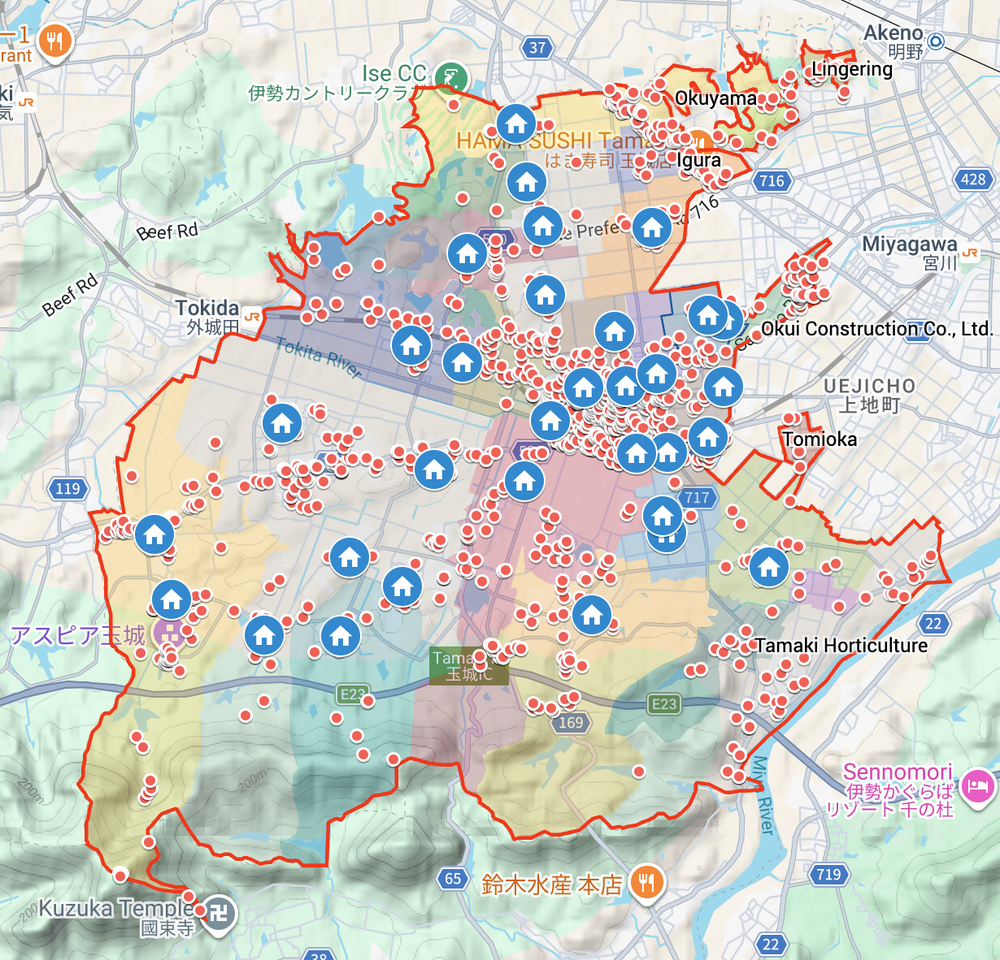

# tamaki-municipality-agent-based-simulation

## Simulation overview
The defined state attributes that were used were:
- **Reasoning**: A plain text attribute for the agent to perform Chain-of-Thought reasoning about its state before filling in the following attributes. Included as a compromise between using reasoning functionality and constrained sampling which are two features that are mutually exclusive in the LLM provider used in this study.
- **Memory**: A plain text attribute for the agent to write down things it deems important to remember for the next state. Included as a compromise between including a long state history (to counteract issues such as "lost in the middle" shown by Liu et al.) and keeping the simulation history-less.
- **Activity**: Different activities that the agent is allowed to choose from during the simulation. What activities are available to choose is based on the type of location the agent was in during the last state.
- **Location**: Different locations that the agent can visit during the simulation. The only way for the agent to change its location in the next state is by selecting a traveling activity in the current state.
- **Time**: A completely deterministic value that is updated each step by a time mapped to an activity in a fixed table.

There was also a set of accompanying prompt arguments included. These served as contextual information for the LLM's decision process, for example distance to other locations.

### Figures

*Red dot icons are locations registered by Google Maps, Blue house icons are randomly picked houses used as agent starting points, the red border is the municipality boundary, the inner multicolored shapes are municipality subdivisions.*

*The flowchart figure visualizes how a sequence of visited states $S$ transitions into a new state $s_{i+1}$ utilizing both inferred LLM choices and deterministic functions.*

*The flowchart figure visualizes how the different scenarios are simulated, the data extracted, aggregated and presented as PIT for decision support. In the simulation code this process is done once for each LLM model.*

## Code overview
A data -> simulation -> results pipeline using the LSPS package. Setup of the pipeline is loosely based on a microservices architecture.

## Data sources
Below is a full list of sources for all the data used in this simulation.

> **!NOTICE!**: Set API URL appId parameter manually (appId=your-app-id) to access, this requires you to sign up on the e-stat website, published by the Japanese government

### 2021 Survey on Time Use and Leisure Activities 

#### Questionnaire A 
[Questionnaire A](https://www.stat.go.jp/english/data/shakai/2021/pdf/qua.pdf), **Accessed**: Jul 15, 2026

#### Questionnaire B 
[Questionnaire B](https://www.stat.go.jp/english/data/shakai/2021/pdf/qub.pdf), **Accessed**: Jul 15, 2026

#### Table Number 78-1-1 
**Statistics name**: Survey on Time Use and Leisure Activities 2021 Survey on Time Use and Leisure Activities Questionnaire A Results on Time Use Time Use for Prefectures, **Table title**: Average time spent in activities for all persons by Kind of activities, Day of the week, Area classification, Sex, Usual economic activity, Age (Heads of One-Person Household)-Japan, Prefectures, **Table URL**: [URL](https://www.e-stat.go.jp/index.php/en/dbview?sid=0003457588), **Table API**: [URL](http://api.e-stat.go.jp/rest/3.0/app/getSimpleStatsData?cdCat04=0%2C1%2C2%2C3%2C4%2C5%2C6%2C7&cdArea=24000&cdTab=202126A99B99&appId=&lang=E&statsDataId=0003457588&metaGetFlg=Y&cntGetFlg=N&explanationGetFlg=Y&annotationGetFlg=Y&sectionHeaderFlg=1&replaceSpChars=0), **Accessed**: Aug 17, 2026

#### Table Number 70-2-2 
**Statistics name**: Survey on Time Use and Leisure Activities 2021 Survey on Time Use and Leisure Activities Questionnaire A Results on Time Use, Time Use for Prefectures, **Table title**: Average time spent in activities for participants by Kind of activities, Day of the week, Area classification, Sex, Usual economic activity, Usual state of health, Age (15 Years Old and Over)-Japan, Prefectures, **Table URL**: [URL](https://www.e-stat.go.jp/en/dbview?sid=0003457375), **Table API**: [URL](https://api.e-stat.go.jp/rest/3.0/app/getStatsData?cdCat01=2&cdCat03=2&cdCat05=6%2C7&cdArea=24000&cdCat06=01%2C02%2C03%2C04%2C05%2C06%2C07%2C08%2C09%2C10%2C11%2C12%2C13%2C14%2C15%2C16%2C17%2C18%2C19%2C20&appId=&lang=E&statsDataId=0003457375&metaGetFlg=Y&cntGetFlg=N&explanationGetFlg=Y&annotationGetFlg=Y&sectionHeaderFlg=1&replaceSpChars=0), **Accessed**: Jul 16, 2026

#### Table Name: Standard Error Ratios of Average time spent in activities for all persons by Sex, Kind of activities - Weekly average, Japan, Prefectures 
**Table URL**: [URL](https://www.stat.go.jp/english/data/shakai/2021/zuhyou/2021gosaA013.xlsx)

#### Table Name: Questionnaire A
**Table URL**: [URL](https://www.stat.go.jp/data/shakai/2021/zuhyou/huhyoua.xlsx)

#### Page name: Outline of the survey
**Page URL**: [URL](https://www.stat.go.jp/english/data/shakai/2021/gaiyo.html)

### 2020 Population Census 

#### Table Number 2-5-1 
**Statistics name**: Population by Sex, Age (single years) and All nationality or Japanese - Japan, Prefectures, Municipalities (including Municipalities as of 2000), **Table title**: Average time spent in activities for participants by Kind of activities, Day of the week, Area classification, Sex, Usual economic activity, Usual state of health, Age (15 Years Old and Over)-Japan, Prefectures, **Table URL**: [URL](https://www.e-stat.go.jp/en/dbview?sid=0003445139), **Table API**: [URL](https://api.e-stat.go.jp/rest/3.0/app/getStatsData?cdCat01=1&cdArea=24461&cdCat03=066%2C067%2C068%2C069%2C070%2C071%2C072%2C073%2C074%2C075%2C076%2C077%2C078%2C079%2C080%2C081%2C082%2C083%2C084%2C085%2C086%2C087%2C088%2C089%2C090%2C091%2C092%2C093%2C094%2C095%2C096%2C097%2C098%2C099%2C100%2C101&appId=&lang=E&statsDataId=0003445139&metaGetFlg=Y&cntGetFlg=N&explanationGetFlg=Y&annotationGetFlg=Y&sectionHeaderFlg=1&replaceSpChars=0), **Accessed**: Jul 16, 2026

#### Table Number 2-2-1 
**Statistics name**: Population Census 2020 Population Census Basic Complete Tabulation on Population and Households, **Table title**: Population by Sex, Age (single years) and All nationality or Japanese - Japan, Prefectures (DIDs), **Table URL**: [URL](https://www.e-stat.go.jp/en/dbview?sid=0003445134), **Table API**: [URL](https://api.e-stat.go.jp/rest/3.0/app/getStatsData?cdArea=24000&cdCat03=066%2C067%2C068%2C069%2C070%2C071%2C072%2C073%2C074%2C075%2C076%2C077%2C078%2C079%2C080%2C081%2C082%2C083%2C084%2C085%2C086%2C087%2C088%2C089%2C090%2C091%2C092%2C093%2C094%2C095%2C096%2C097%2C098%2C099%2C100%2C101%2C102%2C103%2C104%2C105%2C106%2C107%2C108%2C109%2C110%2C111&appId=&lang=E&statsDataId=0003445134&metaGetFlg=Y&cntGetFlg=N&explanationGetFlg=Y&annotationGetFlg=Y&sectionHeaderFlg=1&replaceSpChars=0), **Accessed**: Jul 27, 2026

### 2022 National Survey on Living Conditions 

#### Table Number 30 
**Statistics name**: National Survey on Living Conditions, 2022 National Survey on Living Conditions: Health, **Table title**: Household size (15 years and older), health awareness, gender, age (5-year age groups), and education level, **Table URL**: [URL](https://www.e-stat.go.jp/dbview?sid=0002040972), **Table API**: [URL](https://api.e-stat.go.jp/rest/3.0/app/getStatsData?cdTab=2580&cdTime=15&cdCat02=370%2C400%2C410%2C440%2C450&cdCat04=110&cdCat01=110%2C120%2C130%2C140%2C150%2C160&appId=&lang=J&statsDataId=0002040972&metaGetFlg=Y&cntGetFlg=N&explanationGetFlg=Y&annotationGetFlg=Y&sectionHeaderFlg=1&replaceSpChars=0), **Accessed**: Jul 16, 2026

### Tamaki Town Municipality Boundaries 

[24461 tama-ki-chō (Tamaki Town)](https://www.e-stat.go.jp/gis/statmap-search/data?dlserveyId=A002005212020&code=24461&coordSys=1&format=shape&downloadType=5&datum=2000), [all tables (no download link)](https://www.e-stat.go.jp/gis/statmap-search?page=2&type=2&aggregateUnitForBoundary=A&toukeiCode=00200521&toukeiYear=2020&serveyId=A002005212020&prefCode=24&coordsys=1&format=shape&datum=2000), **Accessed**: Jul 15, 2026
